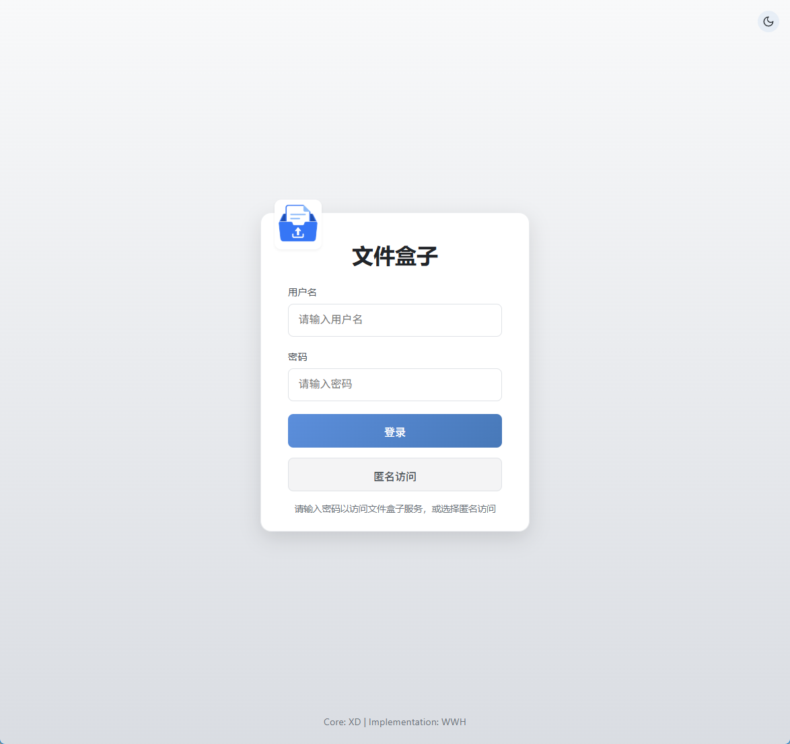
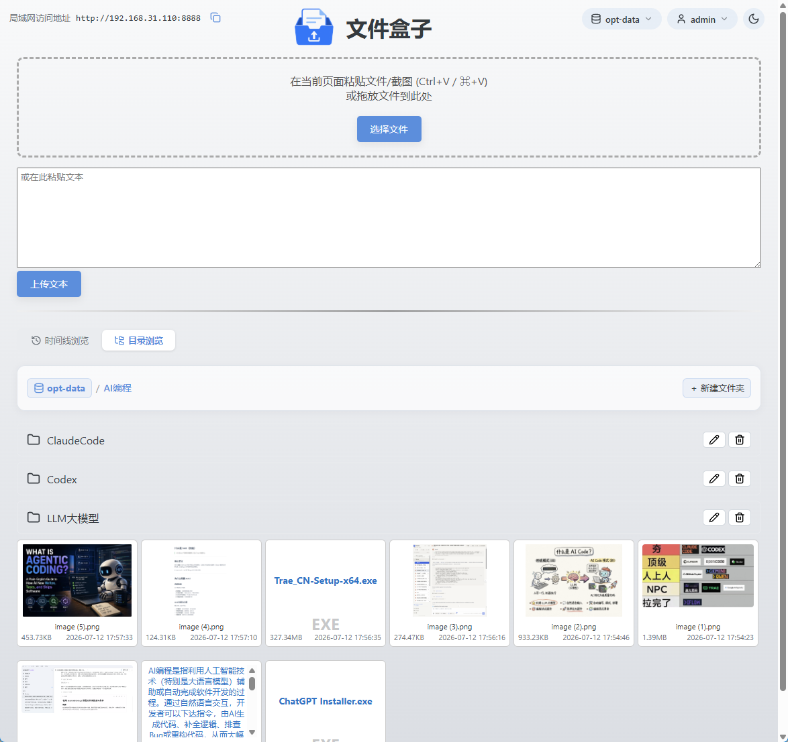
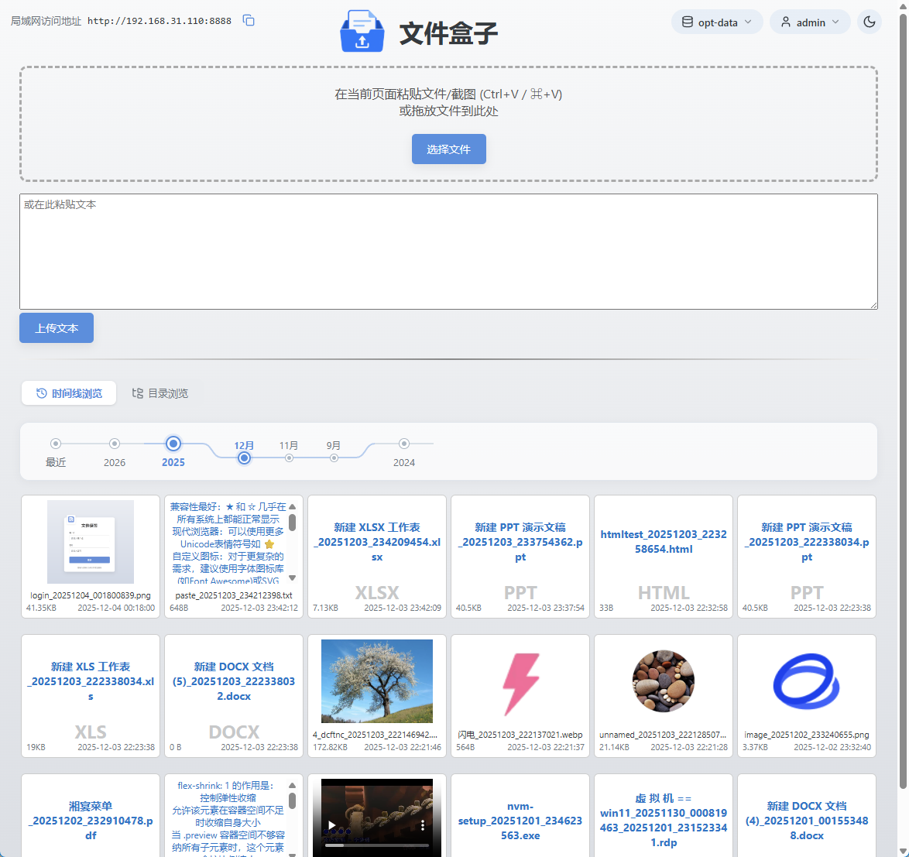
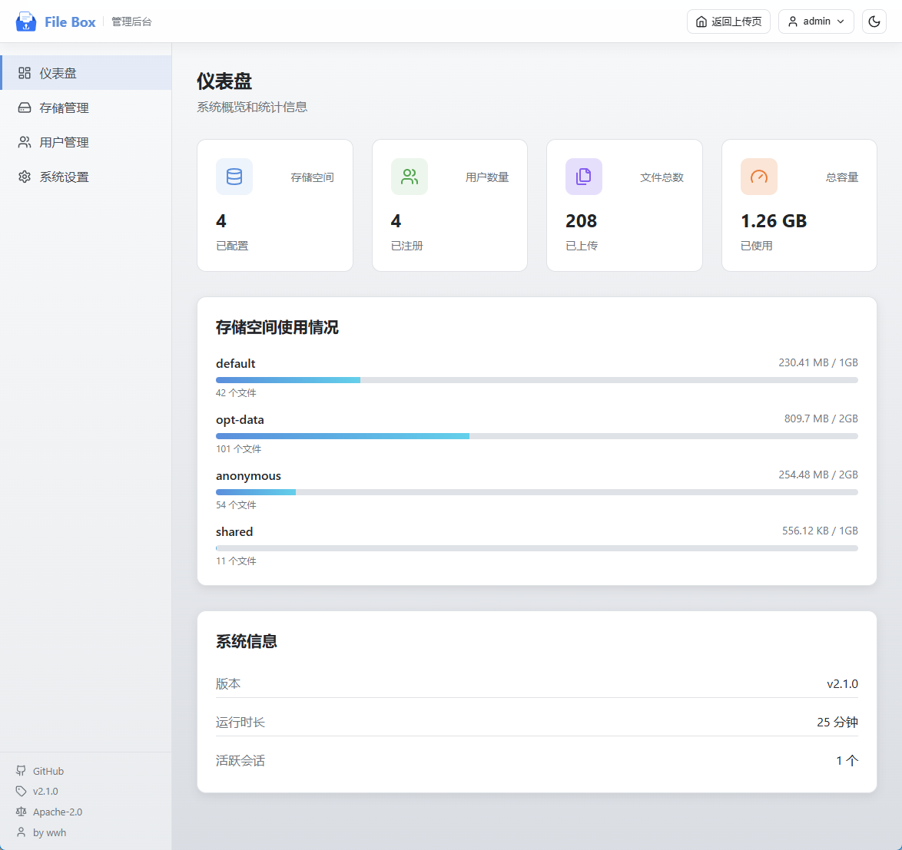

# File Box

File Box 是一款轻量级、自托管的文件分享与管理工具。文件直接存储在本地文件系统中，无需数据库，适合个人、家庭和局域网部署。

启动后即可通过浏览器上传、下载、浏览和管理文件，支持目录与时间线视图、多存储空间、用户权限及匿名访问，配置简单，开箱即用。

## 界面预览

| 登录界面 | 目录视图 |
| --- | --- |
|  |  |
| 时间线视图 | 管理后台 |
|  |  |

## 主要功能

- 文件上传、下载和在线浏览
- 目录视图与时间线视图
- 多存储空间管理
- 用户与角色权限管理
- 可配置的匿名访问和匿名上传
- 文件夹创建、重命名和删除
- 本地文件系统存储，无需数据库
- Web 管理后台

## 快速开始

### 环境要求

- Java 8（推荐）或兼容的更高版本

### 下载

从 [GitHub Releases](https://github.com/wangwen135/file-box/releases) 下载最新的发布包：

```text
file-box-<version>-release.tar.gz
```

下载后解压并进入程序目录。

### Linux

```bash
./start.sh
```

程序将在后台运行，日志位于：

```text
logs/out.log
logs/filebox.log
```

### Windows

双击 `start.bat`，或者在命令行中运行：

```bat
start.bat
```

Windows 下程序在当前窗口中运行，关闭窗口即可停止程序。

### 首次登录

启动后，在浏览器中访问：

```text
http://localhost:8888
```

首次启动会自动创建配置文件、默认存储目录和管理员账号。随机生成的管理员密码只会在首次启动时输出一次：

- Linux：查看 `logs/filebox.log` 或 `logs/out.log`
- Windows：查看启动窗口

请在首次登录后立即修改管理员密码。

## 配置说明

File Box 使用两个配置文件：

| 配置文件 | 用途 |
| --- | --- |
| `config/filebox.yml` | 用户、权限、存储空间和匿名访问等业务配置 |
| `config/application.yml` | 服务端口、上传限制和临时目录等运行配置 |

默认访问端口为 `8888`。如需修改端口，请编辑：

```yaml
# config/application.yml
server:
  port: 8888
```

业务配置默认读取：

```text
./config/filebox.yml
```

用户、存储空间、匿名访问、上传限制及配置路径覆盖方式，请参阅[配置说明](docs/configuration.md)。

## 重置管理员密码

如果忘记管理员密码，可以运行发布包中的管理脚本。

Linux：

```bash
./manage.sh
```

Windows：

```bat
manage.bat
```

然后选择 **Reset admin password**。

程序会生成新的随机密码、更新 `config/filebox.yml`，并在当前终端中输出一次新密码。配置文件中仅保存 BCrypt 密码哈希。

## 开发与构建

构建要求：

- JDK 8
- Maven 3

在项目根目录执行：

```bash
mvn clean package
```

构建产物位于：

```text
target/file-box-<version>.jar
target/file-box-<version>-release.tar.gz
```

## 发布包结构

解压后的发布包结构如下：

```text
file-box-<version>/
  file-box-<version>.jar
  start.sh
  start.bat
  manage.sh
  manage.bat
  config/
    application.yml
  data/
    default/
  logs/
  runtime/
    multipart-tmp/
  LICENSE
  NOTICE
```

## 许可证

本项目基于 [Apache License 2.0](LICENSE) 许可证发布，版权及附加声明请参阅 [NOTICE](NOTICE)。

> 参考 XD 的 [**pasteboard.py**](https://github.com/wangwen135/file-box/blob/release/V0.1.1/references/pasteboard.py) 实现的文件共享和管理工具，使用 Java 重写并增强功能。
